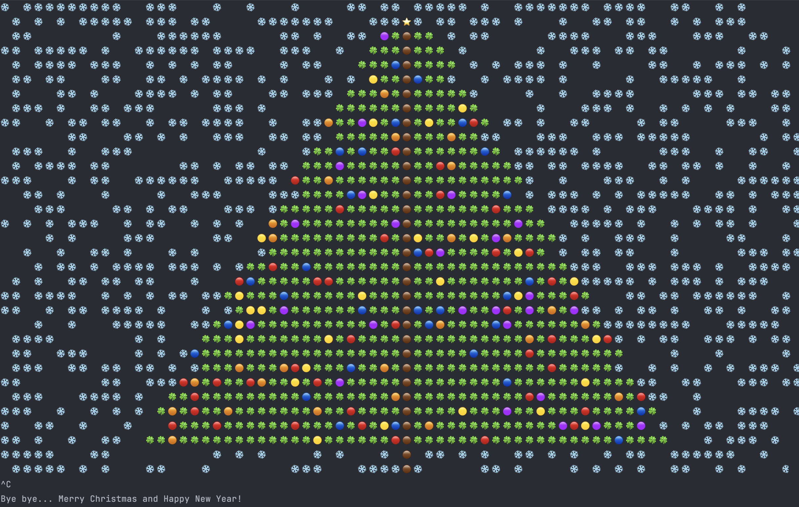

# go-christmas

Just run `go run main.go christmastree.go` and will see the animated Christmas tree decorated by snowflakes.

...or run the executable binary from the [Releases](https://github.com/oleksiivelychko/go-christmas/releases) page.
